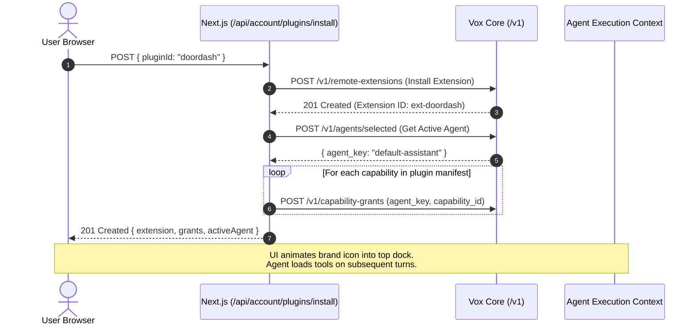

# Consumer Plugin Marketplace & One-Click Agent Integration Design

- **Status**: Approved
- **Date**: 2026-09-26
- **Scope**: `vox-web` consumer workspace, Core extension registry, Agent capability grants

---

## 1. Overview & Goals

Vox enables everyday individuals to access powerful assistants connected to everyday services. This design delivers a consumer-facing **Plugin Marketplace** in the Vox Web application that lets users discover everyday apps (DoorDash, Uber, Zomato, Instacart, Amazon, Spotify, Expedia, Airbnb, Google Calendar) and install them with a **single click**.

Upon installation, the plugin's declared Model Context Protocol (MCP) capabilities are automatically granted to the user's active agent, enabling the assistant to search menus, check fares, inspect hotel rates, track shipments, and prepare orders or handoffs seamlessly.

### Key Objectives
1. **Visual Fidelity**: Match the reference marketplace design with a top installed-plugins dock, a segmented control (`Public` catalog vs. `Personal` custom servers), and categorized two-column grid sections.
2. **Legitimate Brand Icons**: Render authentic, high-resolution vector SVG brand marks for all supported companies (Uber, DoorDash, Zomato, Amazon, Instacart, Spotify, Expedia, Airbnb, Google Calendar, etc.).
3. **One-Click Atomic Installation**: A single compound API endpoint (`POST /api/account/plugins/install`) registers the extension with Vox Core and immediately provisions agent `CapabilityGrant` records without extra user confirmation dialogs.
4. **Agent Tool Accessibility**: As soon as a plugin is installed, the active agent discovers its tools in its effective capability grants and can call them during conversational tasks.
5. **Truthful Outcome & Authority Invariants**: Complies with `CONTEXT.md`—installing an extension grants read and discovery tools; consequential writes or payment authorizations still enforce explicit user approvals.

---

## 2. Architecture & Data Flow

### Sequence: One-Click Installation & Agent Access



---

## 3. Data Model & Catalog Registry

### Catalog Schema (`src/features/plugins/catalog.ts`)

```typescript
export type PluginCategory =
  | "Popular"
  | "Food & Groceries"
  | "Rides & Travel"
  | "Lifestyle & Essentials";

export type CatalogCapability = {
  name: string;
  description: string;
  category: "read" | "write" | "search";
  effectKind?: "read" | "consequential_write";
};

export type CatalogPlugin = {
  id: string;
  displayName: string;
  tagline: string;
  category: PluginCategory;
  brandKey: string;
  accentColor: string;
  operator: {
    operatorId: string;
    operatorName: string;
  };
  endpointUrl: string;
  protocol: "mcp";
  capabilities: CatalogCapability[];
};
```

### Initial Curated Consumer Plugins
1. **Uber** (`uber`):
   - Category: `Popular` & `Rides & Travel`
   - Tagline: "Request rides, check fares, and track active drivers"
   - Capabilities: `estimate_fare`, `get_ride_status`, `request_ride`, `view_trip_history`
2. **DoorDash** (`doordash`):
   - Category: `Popular` & `Food & Groceries`
   - Tagline: "Order food delivery and find nearby restaurants"
   - Capabilities: `search_restaurants`, `inspect_menu`, `check_delivery_time`, `create_order_handoff`
3. **Zomato** (`zomato`):
   - Category: `Popular` & `Food & Groceries`
   - Tagline: "Explore dining, check menus, and reserve tables"
   - Capabilities: `search_dining`, `view_menu`, `check_ratings`, `reserve_table`
4. **Instacart** (`instacart`):
   - Category: `Food & Groceries`
   - Tagline: "Same-day grocery shopping and pantry essentials"
   - Capabilities: `search_groceries`, `check_store_inventory`, `prepare_cart`
5. **Amazon** (`amazon`):
   - Category: `Popular` & `Lifestyle & Essentials`
   - Tagline: "Search products, compare prices, and track packages"
   - Capabilities: `search_catalog`, `compare_deals`, `track_package_shipments`
6. **Expedia** (`expedia`):
   - Category: `Rides & Travel`
   - Tagline: "Search flights, hotel rate plans, and booking confirmations"
   - Capabilities: `search_lodging`, `compare_rates`, `get_itinerary`
7. **Airbnb** (`airbnb`):
   - Category: `Rides & Travel`
   - Tagline: "Find unique stays, experiences, and local hosts"
   - Capabilities: `search_listings`, `inspect_amenities`, `check_dates`
8. **Spotify** (`spotify`):
   - Category: `Lifestyle & Essentials`
   - Tagline: "Find playlists, artists, and control music playback"
   - Capabilities: `search_audio`, `get_current_track`, `add_to_queue`
9. **Google Calendar** (`google-calendar`):
   - Category: `Lifestyle & Essentials`
   - Tagline: "Check free/busy slots and manage your daily schedule"
   - Capabilities: `get_upcoming_events`, `find_open_slots`, `draft_event`

---

## 4. Component Architecture & UI Layout

### File Layout in `vox-web`
- `src/features/plugins/`:
  - `catalog.ts`: Curated catalog definitions and typed helpers.
  - `api.ts`: API clients (`installPlugin`, `uninstallPlugin`, `getCatalog`).
  - `queries.ts`: TanStack Query hooks with optimistic cache mutations.
  - `components/`:
    - `brand-icons.tsx`: Authentic vector SVG brand marks (Uber, DoorDash, Zomato, Amazon, Instacart, Spotify, Expedia, Airbnb, Google Calendar).
    - `installed-plugins-dock.tsx`: Top horizontal row displaying active installed icons with squircle borders and inspector drawer.
    - `plugin-catalog-grid.tsx`: Two-column sectioned grid ("Popular >", "Food & Groceries >", etc.) with search filter.
    - `plugin-card.tsx`: Individual item card showing brand logo, title, description, and 1-click `[+]` button / status.
- `src/features/apps/components/apps-screen.tsx`:
  - Top level container hosting the `Plugins` (Marketplace) vs `Skills` switcher.
  - In `Plugins` view: renders `InstalledPluginsDock`, `Public` vs `Personal` segmented control, and `PluginCatalogGrid` (or custom MCP form under `Personal`).
- `src/app/api/account/plugins/`:
  - `catalog/route.ts`: Serves catalog entries.
  - `install/route.ts`: Atomically installs extension and grants capabilities to the active agent.

---

## 5. Authentic Company Asset Logos

Rather than hand-crafted approximations, we use **official brand SVG assets** sourced directly from company press kits and official brand repositories (the same approach used by ChatGPT, Raycast, and Slack):

- **Storage Location**: Stored as clean, optimized static vector assets in [`public/plugins/logos/`](file:///Users/gowthamtg/Documents/Personal/Vox/vox-web/public/plugins/logos/):
  - `uber.svg`: Official Uber wordmark/symbol on black squircle.
  - `doordash.svg`: Official DoorDash curved double-dash in brand red (`#FF3008`).
  - `zomato.svg`: Official Zomato white logotype/symbol on signature red (`#E23744`).
  - `instacart.svg`: Official Instacart carrot emblem (`#003D29` / `#FF8200` / `#43B02A`).
  - `amazon.svg`: Official Amazon icon with smile arrow (`#FF9900`).
  - `spotify.svg`: Official Spotify soundwave emblem on brand green (`#1ED760`).
  - `airbnb.svg`: Official Airbnb Bélo insignia in brand coral (`#FF5A5F`).
  - `expedia.svg`: Official Expedia yellow and navy travel emblem.
  - `google-calendar.svg`: Official Google Calendar 31 multi-color brand vector.

- **Rendering**: Rendered via Next.js optimized `<Image>` or inline `` with crisp vector scaling, rounded squircle borders, and subtle drop shadows matching the dark theme.

---

## 6. Error Handling & Invariants

1. **Idempotent Installation**: If a plugin is already registered, the backend updates missing capability grants for the active agent and returns success.
2. **Atomicity & Recovery**: If capability grant creation fails after extension installation, the route removes the extension before returning an error to prevent dangling ungranted extensions.
3. **Optimistic UI with Rollback**: TanStack Query updates the card to `Installing…` and immediately displays the icon in the top dock; if the request fails, the cache rolls back and shows an actionable error callout.
4. **Authority Boundary**: Grants give the agent read, search, and preparation tools. If a tool triggers a consequential external write (like placing a live order), it still routes through Core's approval system.

---

## 7. Testing Strategy

1. **Unit Tests** (`tests/plugins-catalog.test.ts`):
   - Validate catalog completeness, unique IDs, and valid endpoint structures.
   - Test compound `POST /api/account/plugins/install` with mock Core client to verify extension creation and grant generation.
   - Test `DELETE /api/account/plugins/[id]` to verify clean revocation.
2. **Typecheck & Linter**:
   - `tsc --noEmit` with 0 errors.
   - ESLint adhering to strict React 19 / Next.js hook rules.
3. **Browser E2E Tests** (`tests/consumer-browser/consumer-app.spec.ts`):
   - Verify Public catalog renders categorized sections ("Popular", "Food & Groceries").
   - Test one-click install of DoorDash: verify icon appears in top dock, button transitions to installed state, and agent grants are active.
